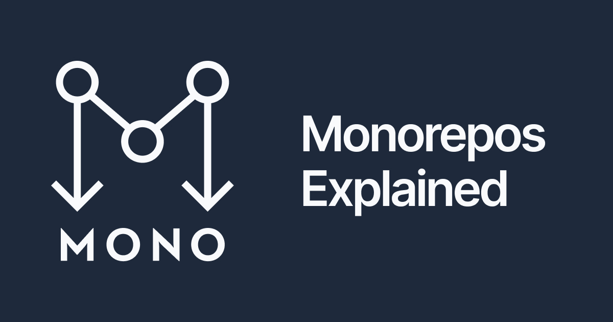

<p align="center">
    <a href="https://ugbanawaji.com/api/v1/documentation" target="_blank">
        
    </a>
</p>

<p align="center">

</p>


## Motivation behind this MONOREPO

I build this repo as result of common problem in everyday interview (take home assignment). It is a collective of carefully curated programs designed and developed for learning purposes and demonstration of experiences of the years.
You would probably find your take home assignment here. It's free for your use, but don't forget the credit. The backend is robust with test cover for almost all line of code.

## Monorepo Playground

Welcome to the Monorepo Playground! This repository contains various projects and experiments using Laravel PHP, Next.js, and React.js. It serves as a playground for exploring new features, testing ideas, and tinkering with different technologies.

## Table of Contents

- [Projects](#projects)
    - [Laravel PHP](#Backend)
    - [Next.js](#nextjs)
    - [React.js](#reactjs)
- [Setup](#setup)
- [Scripts](#scripts)
- [Contributing](#contributing)
- [License](#license)

## Projects

### Backend

The Laravel PHP project is a backend application providing APIs and other server-side functionalities.

### Next.js

The Next.js project is a server-rendered React application that uses the Laravel backend for its API.

### React.js

The React.js project is a client-side application that interacts with both the Laravel backend and the Next.js frontend.

## Setup

To set up the monorepo locally, follow these steps:

1. **Clone the repository**

   ```bash
   git clone https://github.com/yourusername/monorepo-playground.git
   cd monorepo-playground
   ```

2. **Install dependencies for Laravel**

   ```bash
   cd laravel-app
   composer install
   cp .env.example .env
   php artisan key:generate
   php artisan migrate
   ```

3. **Install dependencies for Next.js**

   ```bash
   cd ../nextjs-app
   npm install
   cp .env.example .env
   ```

4. **Install dependencies for React.js**

   ```bash
   cd ../reactjs-app
   npm install
   ```

## Scripts

Here are the common scripts you might need:

- **Start Laravel server**

  ```bash
  cd laravel-app
  php artisan serve
  ```

- **Start Next.js server**

  ```bash
  cd nextjs-app
  npm run dev
  ```

- **Start React.js development server**

  ```bash
  cd reactjs-app
  npm start
  ```

- **Build Next.js for production**

  ```bash
  cd nextjs-app
  npm run build
  ```

- **Build React.js for production**

  ```bash
  cd reactjs-app
  npm run build
  ```

## Contributing

We welcome contributions! Please follow these steps to contribute:

1. Fork the repository.
2. Create a new branch (\`git checkout -b feature/your-feature\`).
3. Make your changes.
4. Commit your changes (\`git commit -m 'Add some feature'\`).
5. Push to the branch (\`git push origin feature/your-feature\`).
6. Open a Pull Request.

## License

This project is licensed under the MIT License - see the [LICENSE](LICENSE) file for details.
